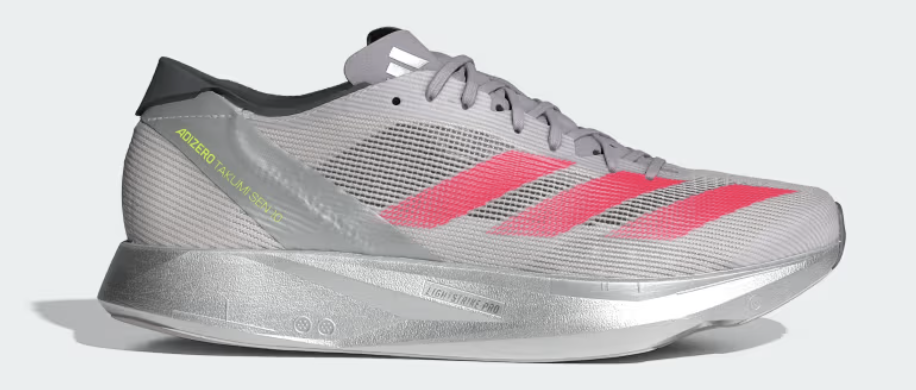

<section class="md:col-span-2 space-y-8">

      <!-- 目次 -->
      <nav class="p-5 bg-white rounded-2xl border shadow-sm">
        <h2 class="text-lg font-bold mb-3 flex items-center gap-2 text-gray-800">
          <i class="fa-solid fa-list text-orange-500"></i> 目次
        </h2>
        <ul class="list-disc ml-6 text-blue-700 space-y-1">
          <li><a href="#difference" class="hover:underline">タクミセン10との違い</a></li>
          <li><a href="#size" class="hover:underline">サイズ感</a></li>
          <li><a href="#impression" class="hover:underline">履いた感想</a></li>
        </ul>
      </nav>

      <!-- 本文 -->
 <article class="space-y-10">
  <!-- タクミセン10との違い -->
  

    <h2 class="text-2xl font-bold border-b pb-2">
      タクミセン10との違い
    </h2>

    <!-- 比較テーブル -->
    

      <table class="table-auto border-collapse border border-gray-400 mt-6 w-full max-w-5xl mx-auto text-center">
        <thead>
          <tr class="bg-gray-100">
            <th class="border border-gray-400 px-4 py-2 w-32"></th>
            <th class="border border-gray-400 px-4 py-2">
              タクミセン10 
              
            </th>
            <th class="border border-gray-400 px-4 py-2">
              タクミセン11 
              
            </th>
          </tr>
        </thead>
        <tbody>
          <tr>
            <td class="border border-gray-400 px-4 py-2 font-semibold">ミッドソールドロップ</td>
            <td class="border border-gray-400 px-4 py-2">6 mm</td>
            <td class="border border-gray-400 px-4 py-2">7 mm</td>
          </tr>
          <tr>
            <td class="border border-gray-400 px-4 py-2 font-semibold">ヒール</td>
            <td class="border border-gray-400 px-4 py-2">33 mm</td>
            <td class="border border-gray-400 px-4 py-2">33 mm</td>
          </tr>
          <tr>
            <td class="border border-gray-400 px-4 py-2 font-semibold">前足部</td>
            <td class="border border-gray-400 px-4 py-2">27 mm</td>
            <td class="border border-gray-400 px-4 py-2">26 mm</td>
          </tr>
          <tr>
            <td class="border border-gray-400 px-4 py-2 font-semibold">重量</td>
            <td class="border border-gray-400 px-4 py-2">200g</td>
            <td class="border border-gray-400 px-4 py-2">188g（27cm）</td>
          </tr>
          <tr>
            <td class="border border-gray-400 px-4 py-2 font-semibold">価格</td>
            <td class="border border-gray-400 px-4 py-2">17,600円</td>
            <td class="border border-gray-400 px-4 py-2">24,200円</td>
          </tr>
        </tbody>
      </table>
    

  

</article>

          <ul class="list-disc ml-6 text-gray-700 space-y-2">
            <li>高推進力グラスファイバー製5本指ロッド「ENERGYRODS 2.0」</li>
            <li>高反発素材「LIGHTSTRIKE PRO」</li>
          </ul>
          

            タクミセン11は<strong>ノンカーボンのグラスファイバー製５本指ロッド</strong>が採用されています。  
            また、ソールもアップデートされ、10までと違い<strong>かなり柔らかい素材</strong>になりました。
          

          

            ぱっと見厚さも厚くなったように見えましたが、厚さはほぼ変わりません。
          

          

            重さは軽くなりました。これにより10より扱いやすさが増した印象があります。
          

          

            アッパーについても変更され、より<strong>アディオスプロ４のような見た目</strong>になっています。
          

          
        

        <!-- サイズ感 -->
        

          <h2 class="text-2xl font-bold border-b pb-2">
            サイズ感
          </h2>
          

            サイズ感はタクミセン10や他のシューズと変わりませんでした。  
            <strong>マイサイズで問題なさそうです。</strong>
          

        

        <!-- 履いた感想 -->
        

          <h2 class="text-2xl font-bold border-b pb-2">
            履いた感想
          </h2>
          
          

            今回はTeam M×Kと、adidasのトライオン企画で履きました。  
            まず、私がタクミセンシリーズで気になっていた<strong>踵のフィット感</strong>について。  
            ずっと踵が緩く靴擦れなどを起こすことが多かったですが、とりあえず今回15km走った後に靴擦れはしませんでした。  
            ただ、<strong>フィット感がかなりいいという訳ではありません。</strong>  
            10よりは緩さは軽減されましたが、依然フィット感は甘いと感じました。
          

          

            反発については<strong>若干物足りない</strong>ですね。  
            マラソンで履くならやはりプロ4だなと思います。  
            ただ、ソールが柔らかくなったのはかなり感じたため、<strong>前作より長い距離を走れるようになりつつ、コントロールがしやすい</strong>です。
          

          

            用途としては<strong>トラックやスピード練習用</strong>になるでしょうか。  
            とはいえこの用途は現在履いている<strong>PUMA ディヴィエイトニトロエリート3</strong>が反発や扱いやすさ共に完全に上位互換ですね。
          

<!-- 他記事引用カード（images付き） -->

  

    <!-- サムネイルimages -->
    

      
    

    <!-- テキスト部分 -->
    

      

        <h3 class="text-lg font-bold text-gray-800 mb-2 flex items-center gap-2">
          <i class="fa-solid fa-quote-left text-orange-500"></i>
          PUMA ディヴィエイト ニトロ エリート3 レビュー
        </h3>
        

          反発性・クッション性のバランスに優れた最新モデル。実際の履き心地や特徴を詳しくまとめています。
        

      

      

        <a href="puma_deviate.html" 
           class="inline-block px-4 py-2 bg-orange-500 text-white font-semibold rounded-lg shadow hover:bg-orange-600 transition"
           rel="noopener noreferrer">
          記事を読む
        </a>
      

    

  

        

        
ちなみに今回は15kmの4'05⇆4'35のペーサーで履きました。このようなペース変化のある練習でもペースコントロールがしやすかったです。

        
        

        
<!-- 商品購入リンクカード -->

  <!-- 商品images -->
  

  <!-- 商品名 -->
  <h3 class="font-bold text-lg mb-2 text-gray-800">
    アディゼロ アディオス プロ 4 ADIZERO ADIOS PRO 4 クラウドホワイト/コアブラック/シルバーメタリック
  </h3>

  <!-- 商品説明 -->
  

    adidasの最新レーシングシューズ。軽量で反発性に優れた厚底モデル。
  

  <!-- 購入リンク -->
  

    <!-- Amazonリンク -->
    <a href="https://af.moshimo.com/af/c/click?a_id=3871589&p_id=170&pc_id=185&pl_id=27060&url=https%3A%2F%2Fwww.amazon.co.jp%2Fdp%2FB0F7LCXSVZ"
       class="block text-center px-4 py-2 rounded-lg bg-orange-500 text-white font-semibold hover:bg-orange-600 transition"
       target="_blank" rel="nofollow noopener">Amazonで見る</a>

    <!-- 楽天リンク -->
    <a href="https://af.moshimo.com/af/c/click?a_id=3871516&p_id=54&pc_id=54&pl_id=616&url=https%3A%2F%2Fsearch.rakuten.co.jp%2Fsearch%2Fmall%2F%25E3%2582%25BF%25E3%2582%25AF%25E3%2583%259F%25E3%2582%25BB%25E3%2583%25B3%2B11%2F"
       class="block text-center px-4 py-2 rounded-lg bg-red-500 text-white font-semibold hover:bg-red-600 transition"
       target="_blank" rel="nofollow noopener">楽天市場で見る</a>

    <!-- Yahooリンク（仮Moshimoリンク） -->
    <a href="https://af.moshimo.com/af/c/click?a_id=3871592&p_id=1225&pc_id=1925&pl_id=18502&url=https%3A%2F%2Fshopping.yahoo.co.jp%2Franking%2Fkeyword%2F%3Fp%3D%25E3%2582%25BF%25E3%2582%25AF%25E3%2583%259F%25E3%2582%25BB%25E3%2583%25B311"
       class="block text-center px-4 py-2 rounded-lg bg-blue-500 text-white font-semibold hover:bg-blue-600 transition"
       target="_blank" rel="nofollow noopener">Yahoo!ショッピングで見る</a>
  

      </article>
    </section>
